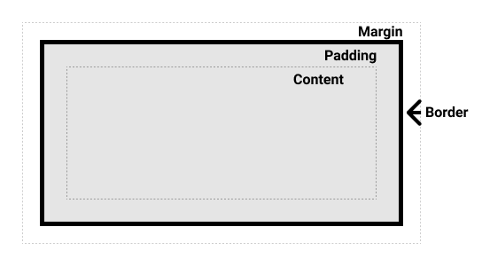

# CSS的盒子模型

    
            1、CSS盒模型是两个盒子组成，外在的控制是否换行的盒子，以及内在的控制元素内容的盒子。比如：display:inline-block,则它
        的外在的盒子就是inline也就是不占据一行，而block则表示内部的元素具有块状特征。所以，display:line就是display:inline-inline的
        缩写，display:block就是display:block-block的缩写。
        
            2、每一个内在的盒子有：width/height,padding,border,margin这几个控制盒子大小的属性。其中width/height控制元素内容大小，
        padding则控制元素内容到border线内侧距离，border则是元素外围边框大小，而margin则是控制与其他元素的间距，它的背景透明

            3、对于早起，计算一个元素的占据大小，需要通过 width + 2* padding + 2* border来计算，CSS3中提出了box-sizing：border-box,
        通过这样的设置，就可以使元素的最终的宽高就是设定的width/height,浏览器会根据width/height,padding,border的大小来自动调整内部元素的大小。

