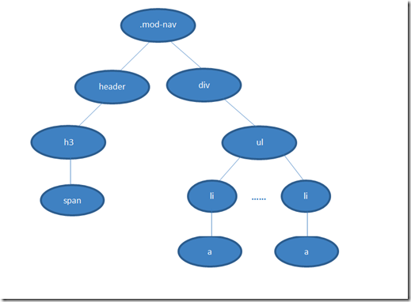

# 说说浏览器解析CSS选择器的过程

            上到下，从右到左
            
            因为从左到右，首先浏览器会遍历你最左边的选择器，可能是div，可能是span，我需要在整个页面去把匹配成功的dom找出来，可以说是海底捞针，但是从右到左不一样了，它通过具体的遍历条件去寻找一个最匹配的值，查找之后在向上查询，是否符合自己的选择器规则，才最后匹配成功；
            
            前者会浪费大量的遍历时间，造成大量错误的匹配结果

            假如dom的结构如上图，匹配规则是 .mod-nav h3 span
        
            若从左到右的匹配，过程是：从 .mod-nav 开始，遍历子节点header和子节点div，然后各自向子节点遍历。往
        右侧div的分支中，最后遍历到叶子节点a，发现不符合规则，需要回溯到ul节点，在遍历下一个li-a，假如有1000个
        li，则这1000次的遍历与回溯会损失很多性能
        
            在看看从右往左侧遍历，先找到所有的最右节点span，对于每一个span，向上寻找节点h3，
        由h3再向上寻找class=mod-nav的节点，最后找到根元素html则结束这个分支的遍历。

            具体参照二叉树的遍历方法    
        